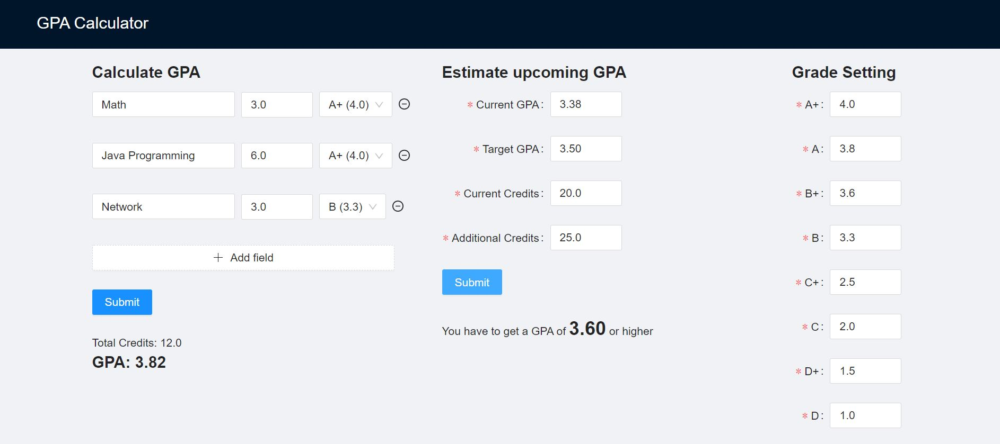

# Todo - App
Calculate your GPA with this application. You can also estimate your GPA for the upcoming term to get the target GPA in total. Furthermore, the score corresponding to each grade can be changed depending on your school!

---
## URL
https://gpa-calculator-14a4b.web.app/

## Image


## Getting Started
copy this project into your local machine
- install npm
```
yarn install 
```
- launch app
```
yarn start
```

## Tech Stack
- React
- TypeScript
- Ant Design
- Firebase

## Author
Takuto Okamoto

## License
[MIT](https://choosealicense.com/licenses/mit/)